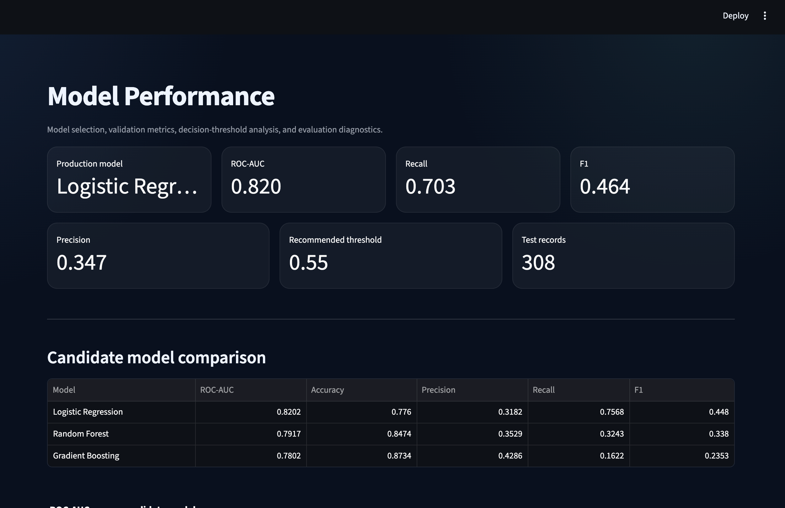
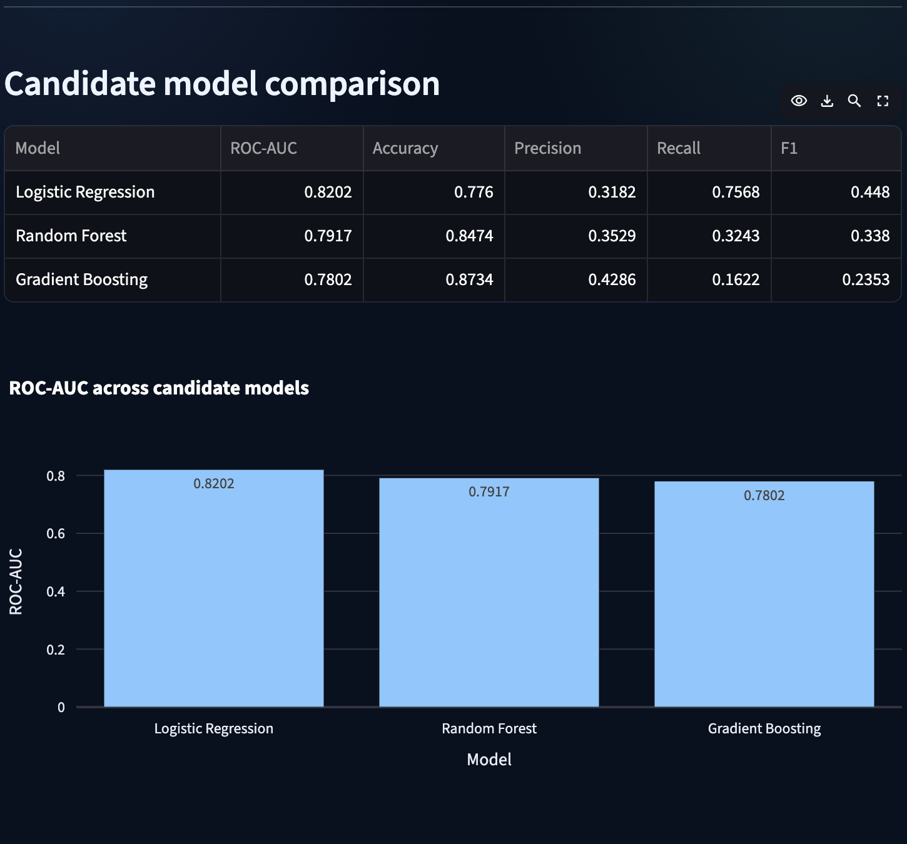
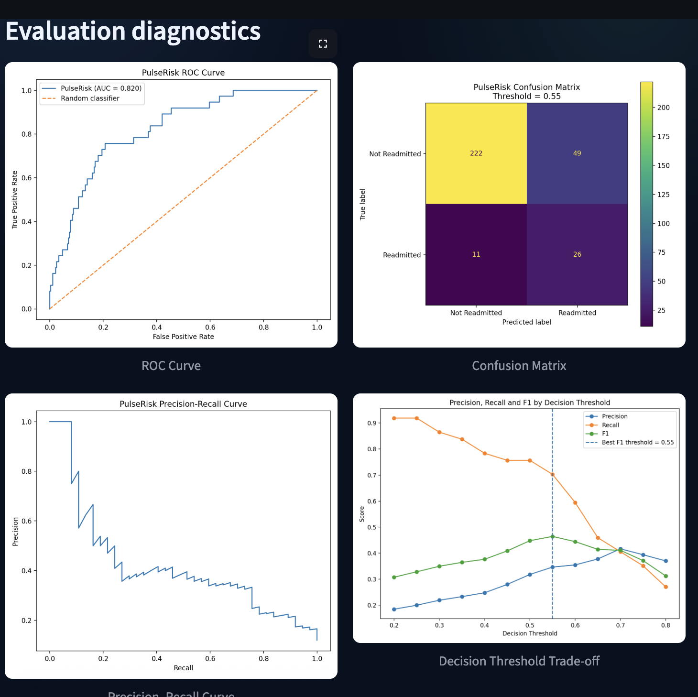

# PulseRisk

## Explainable Patient Readmission Risk & Analytics Platform

PulseRisk is an end-to-end machine-learning application for analyzing synthetic patient data and estimating 30-day hospital readmission risk.

The project combines **machine-learning model development, model comparison, explainability, REST API inference, interactive analytics, data-quality monitoring, audit logging, automated testing, and containerized deployment** in a single application.

> **Important:** PulseRisk uses synthetic patient data exclusively. It is a portfolio and software-engineering demonstration and is not intended for diagnosis, treatment, triage, or real-world clinical decision-making.

---

## Live Demo

- **Live Application:** https://pulserisk-ai.streamlit.app/
- **API Documentation:** https://pulserisk-api.onrender.com/docs
- **Source Code:** https://github.com/HaripriyaReddyPatil/pulserisk

---

# Project Highlights

PulseRisk demonstrates a complete machine-learning application lifecycle:

- Synthetic healthcare data generation
- Data preprocessing and missing-value handling
- Comparison of multiple machine-learning algorithms
- Model selection using ROC-AUC
- Accuracy, precision, recall, and F1 evaluation
- Decision-threshold analysis
- Global model explainability
- Patient-level model explanations
- REST API inference with FastAPI
- Interactive Streamlit dashboard
- Cohort-level analytics
- Data-quality validation
- SQLite audit logging
- Automated API testing
- Docker-based deployment

---

# Machine Learning Results

PulseRisk evaluates three candidate classification models using the same stratified train/test split.

| Model | ROC-AUC | Accuracy | Precision | Recall | F1 |
|---|---:|---:|---:|---:|---:|
| Logistic Regression | **0.8202** | 0.7760 | 0.3182 | **0.7568** | **0.4480** |
| Random Forest | 0.7917 | 0.8474 | 0.3529 | 0.3243 | 0.3380 |
| Gradient Boosting | 0.7802 | **0.8734** | **0.4286** | 0.1622 | 0.2353 |

## Selected Production Model

**Logistic Regression**

The production model is selected using **ROC-AUC**, which measures ranking performance across classification thresholds.

Logistic Regression achieved the highest ROC-AUC among the evaluated models while also producing substantially higher recall than the tree-based alternatives.

---

# Decision Threshold Analysis

The default binary classification threshold is `0.50`.

PulseRisk also evaluates thresholds from `0.20` through `0.80` to analyze the trade-off between precision and recall.

The strongest F1 score in the current evaluation occurs at:

- **Recommended threshold:** `0.55`
- **ROC-AUC:** `0.8202`
- **Precision:** `0.3467`
- **Recall:** `0.7027`
- **F1 score:** `0.4643`
- **Test records:** `308`

Confusion matrix at the recommended threshold:

| | Predicted Negative | Predicted Positive |
|---|---:|---:|
| Actual Negative | 222 | 49 |
| Actual Positive | 11 | 26 |

The recommended threshold is presented as an evaluation result rather than being treated as a universal clinical decision boundary.

The application also uses separate visualization bands for displaying Low, Medium, and High risk. These display bands should not be interpreted as medically validated thresholds.

---

# Screenshots

## Overview


## Patient Explorer


## Risk Predictor


## Model Performance

### Metrics and Model Comparison



### Evaluation Diagnostics



### Threshold Analysis and Methodology



## Cohort Analytics


## API Documentation


---

# Application Features

## Overview Dashboard

The Overview dashboard provides a population-level view of the synthetic patient cohort.

It displays:

- Total patient count
- High-risk patient count
- Average predicted risk
- Observed readmission rate
- Predicted risk distribution
- Average predicted risk by age group
- Global model feature influence

---

## Patient Explorer

The Patient Explorer provides an individual view of a synthetic patient.

Users can review:

- Patient ID
- Age
- Gender
- Most recent admission
- BMI
- Systolic blood pressure
- HbA1c
- LDL
- Length of stay
- Prior admissions
- Comorbidity burden
- Predicted 30-day readmission probability
- Risk category
- Patient-specific model contributions
- Synthetic patient timeline
- Automatically generated patient summary

---

## Risk Predictor

The Risk Predictor allows users to enter patient features and generate a 30-day readmission-risk prediction.

Model inputs include:

- Age
- BMI
- Systolic blood pressure
- HbA1c
- LDL
- Length of stay
- Prior admissions
- Comorbidity count

Predictions are sent to the FastAPI backend and returned to the Streamlit application.

The result includes:

- Risk probability
- Risk category
- Model used
- Top model drivers
- API scoring status

---

# Model Explainability

PulseRisk provides both **global** and **patient-level** model explanations.

## Global Feature Influence

For the selected Logistic Regression model, global feature importance is based on the absolute magnitude of standardized model coefficients.

The strongest model drivers in the current trained model are:

1. Age
2. Systolic blood pressure
3. Prior admissions
4. BMI
5. Comorbidity count
6. HbA1c
7. Length of stay
8. LDL

The coefficient direction indicates whether a feature pushes the model toward higher or lower estimated risk.

---

## Patient-Level Explanations

For individual patients, PulseRisk calculates feature contributions using:

```text
standardized feature value × logistic regression coefficient
```

Positive contributions push the prediction toward higher estimated risk.

Negative contributions push the prediction toward lower estimated risk.

This provides an interpretable explanation of how each patient's characteristics influence the model output.

---

# Model Performance Dashboard

PulseRisk includes a dedicated model-evaluation dashboard.

It displays:

- Selected production model
- ROC-AUC
- Precision
- Recall
- F1 score
- Recommended classification threshold
- Test-set size
- Candidate model comparison table
- ROC-AUC comparison chart
- ROC curve
- Precision-recall curve
- Confusion matrix
- Threshold trade-off analysis
- Model-selection methodology

This makes model evaluation visible directly inside the application instead of hiding evaluation inside training scripts.

---

# Cohort Analytics

Users can interactively filter the synthetic patient population using:

- Age range
- Gender
- Risk level
- Readmission status

The cohort dashboard provides:

- Patient count
- Average predicted risk
- Observed readmission rate
- Age versus predicted risk visualization
- Risk by comorbidity burden
- Highest-risk patients in the selected cohort

---

# Data Quality Center

The Data Quality page performs validation of the underlying synthetic patient dataset.

Checks include:

- Missing values
- Duplicate patient IDs
- BMI range violations
- Systolic blood-pressure range violations
- HbA1c range violations
- Overall dataset completeness

Missing numeric model inputs are handled by the machine-learning preprocessing pipeline using median imputation.

---

# Audit Logging

PulseRisk maintains a lightweight SQLite audit trail for selected application and API events.

Example events include:

- Patient profile views
- API patient lookups
- Risk predictions
- Cohort filter actions

This demonstrates basic traceability and observability patterns in application design.

---

# System Architecture

```text
                    ┌─────────────────────────┐
                    │ Synthetic Patient Data  │
                    └────────────┬────────────┘
                                 │
                                 ▼
                    ┌─────────────────────────┐
                    │ Data / ML Pipeline      │
                    │                         │
                    │ - preprocessing         │
                    │ - median imputation     │
                    │ - scaling               │
                    │ - train/test split      │
                    └────────────┬────────────┘
                                 │
                                 ▼
          ┌───────────────────────────────────────────┐
          │ Candidate Model Training                  │
          │                                           │
          │ - Logistic Regression                     │
          │ - Random Forest                           │
          │ - Gradient Boosting                       │
          └────────────────────┬──────────────────────┘
                               │
                               ▼
                    ┌─────────────────────────┐
                    │ Model Evaluation        │
                    │                         │
                    │ - ROC-AUC               │
                    │ - Accuracy              │
                    │ - Precision             │
                    │ - Recall                │
                    │ - F1                    │
                    │ - Threshold Analysis    │
                    └────────────┬────────────┘
                                 │
                                 ▼
                    ┌─────────────────────────┐
                    │ Selected Model          │
                    │ Logistic Regression     │
                    └────────────┬────────────┘
                                 │
                  ┌──────────────┴──────────────┐
                  │                             │
                  ▼                             ▼
        ┌──────────────────┐          ┌──────────────────┐
        │ FastAPI Backend  │          │ Explainability   │
        │                  │          │                  │
        │ /health          │          │ Global drivers   │
        │ /model-info      │          │ Local drivers    │
        │ /patients        │          └─────────┬────────┘
        │ /patients/{id}   │                    │
        │ /predict         │                    │
        │ /metrics         │                    │
        └─────────┬────────┘                    │
                  │                             │
                  └──────────────┬──────────────┘
                                 │
                                 ▼
                    ┌─────────────────────────┐
                    │ Streamlit Frontend      │
                    │                         │
                    │ - Overview              │
                    │ - Patient Explorer      │
                    │ - Risk Predictor        │
                    │ - Model Performance     │
                    │ - Cohort Analytics      │
                    │ - Data Quality          │
                    │ - Audit Log             │
                    │ - About                 │
                    └─────────────────────────┘
```

---

# API

PulseRisk exposes a REST API using FastAPI.

## Health Endpoint

```http
GET /health
```

Example response:

```json
{
  "status": "ok",
  "model_loaded": true,
  "api_version": "1.1.0",
  "disclaimer": "Synthetic portfolio demonstration only. Not for clinical use."
}
```

---

## Model Information

```http
GET /model-info
```

Returns:

- Model metadata
- Candidate model comparison
- Evaluation results
- Global feature importance

---

## Patient Records

```http
GET /patients
```

Returns a limited set of synthetic patient records.

---

## Individual Patient

```http
GET /patients/{patient_id}
```

Returns one synthetic patient record matching the supplied patient ID.

---

## Prediction

```http
POST /predict
```

Example request:

```json
{
  "age": 58,
  "bmi": 29.0,
  "systolic_bp": 138,
  "hba1c": 6.4,
  "ldl": 130,
  "length_of_stay": 4,
  "prior_admissions": 1,
  "comorbidity_count": 2
}
```

The response contains:

- Prediction probability
- Risk percentage
- Risk category
- Active model type
- Top patient-level model drivers

Interactive Swagger documentation is available at:

```text
/docs
```

---

# Tech Stack

## Frontend

- Streamlit
- Plotly
- Pandas

## Backend

- FastAPI
- Pydantic
- Uvicorn

## Machine Learning

- scikit-learn
- Logistic Regression
- Random Forest
- Gradient Boosting
- StandardScaler
- SimpleImputer
- Pipeline-based preprocessing
- ROC-AUC evaluation
- Precision-recall analysis
- Decision-threshold analysis

## Data and Storage

- Synthetic healthcare dataset
- CSV
- SQLite

## Testing

- pytest
- FastAPI TestClient

## Development and Deployment

- Python
- Git
- GitHub
- Docker
- Docker Compose
- Render
- Streamlit Community Cloud

---

# Project Structure

```text
pulserisk/
│
├── backend/
│   ├── __init__.py
│   ├── main.py
│   ├── schemas.py
│   └── services.py
│
├── frontend/
│   ├── __init__.py
│   └── app.py
│
├── ml/
│   ├── generate_data.py
│   ├── train_model.py
│   ├── evaluate_model.py
│   ├── explain_model.py
│   ├── risk_model.joblib
│   ├── metrics.json
│   ├── model_comparison.json
│   ├── model_metadata.json
│   │
│   ├── evaluation/
│   │   ├── evaluation_summary.json
│   │   ├── threshold_analysis.csv
│   │   ├── confusion_matrix.png
│   │   ├── roc_curve.png
│   │   ├── precision_recall_curve.png
│   │   └── threshold_tradeoff.png
│   │
│   └── explanations/
│       ├── model_explanations.json
│       ├── global_feature_importance.csv
│       ├── global_feature_importance.png
│       └── feature_direction.png
│
├── data/
│   ├── patients.csv
│   └── audit.db
│
├── screenshots/
│   ├── overview.png
│   ├── patient-explorer.png
│   ├── risk-predictor.png
│   ├── model-performance-top.png
│   ├── model-performance-middle.png
│   ├── model-performance-bottom.png
│   ├── cohort-analytics.png
│   └── api-docs.png
│
├── tests/
│   └── test_api.py
│
├── Dockerfile.api
├── Dockerfile.streamlit
├── docker-compose.yml
├── requirements.txt
├── PROJECT_STRUCTURE.txt
└── README.md
```

---

# Running Locally

Clone the repository:

```bash
git clone https://github.com/HaripriyaReddyPatil/pulserisk.git
cd pulserisk
```

Install dependencies:

```bash
python3 -m pip install -r requirements.txt
```

Train and compare the candidate models:

```bash
python3 ml/train_model.py
```

Run model evaluation and threshold analysis:

```bash
python3 ml/evaluate_model.py
```

Generate model explanations:

```bash
python3 ml/explain_model.py
```

Start the FastAPI backend:

```bash
python3 -m uvicorn backend.main:app --reload
```

The API runs locally at:

```text
http://127.0.0.1:8000
```

Swagger documentation:

```text
http://127.0.0.1:8000/docs
```

Open a second terminal and start the Streamlit frontend:

```bash
cd ~/pulserisk
python3 -m streamlit run frontend/app.py
```

The frontend normally runs at:

```text
http://localhost:8501
```

---

# Running Tests

Run the automated test suite with:

```bash
python3 -m pytest -q
```

Current result:

```text
2 passed
```

---

# Docker

PulseRisk includes separate Docker configurations for the FastAPI backend and Streamlit frontend.

Run both services using:

```bash
docker compose up --build
```

---

# Design Decisions

## Why Compare Multiple Models?

A production-style machine-learning workflow should evaluate multiple candidate algorithms rather than choosing one model without comparison.

PulseRisk therefore evaluates:

- Logistic Regression
- Random Forest
- Gradient Boosting

All models use the same holdout dataset for comparison.

---

## Why Logistic Regression?

Logistic Regression achieved the strongest ROC-AUC in the current experiment and substantially higher recall than the alternative models.

It also provides direct coefficient-based interpretability, making it well suited to an explainable demonstration system.

---

## Why Analyze the Classification Threshold?

A probability model does not inherently require a `0.50` operating threshold.

PulseRisk evaluates multiple thresholds so the relationship between precision, recall, false positives, and false negatives is visible rather than hidden.

---

## Why FastAPI and Streamlit?

FastAPI separates prediction and backend service logic from the user interface.

Streamlit provides the interactive analytics layer.

This creates a service-oriented architecture rather than placing all prediction logic directly inside the frontend.

---

## Why Use Pipelines?

The scikit-learn pipeline keeps preprocessing and prediction logic together.

This helps ensure that training and inference use the same transformation steps, including:

- Median imputation
- Feature scaling where required
- Model prediction

---

# Limitations

PulseRisk has several intentional limitations:

- The patient dataset is synthetic.
- The model has not been trained or validated on real clinical data.
- Evaluation metrics do not represent real-world clinical performance.
- The patient timeline is generated for demonstration purposes.
- Risk categories are application-level visualization bands.
- The recommended classification threshold is based on the synthetic test set.
- The system is not a medical device.
- The application must not be used for real patient-management decisions.

---

# Future Improvements

Potential future extensions include:

- External model validation
- Cross-validation
- Probability calibration
- Hyperparameter optimization
- Experiment tracking
- Model-drift monitoring
- CI/CD workflows
- Authentication
- Role-based access control
- Persistent production database
- Expanded automated test coverage
- Monitoring and logging infrastructure
- SHAP-based explanations for nonlinear models

---

# Author

**Haripriya Reddy Patil**

Master's Student in Computer Science  
Rutgers University-New Brunswick

GitHub: https://github.com/HaripriyaReddyPatil

---

# Disclaimer

PulseRisk is an educational and portfolio project built using synthetic patient data.

It must not be used to make healthcare, medical, diagnostic, treatment, triage, or patient-management decisions.
