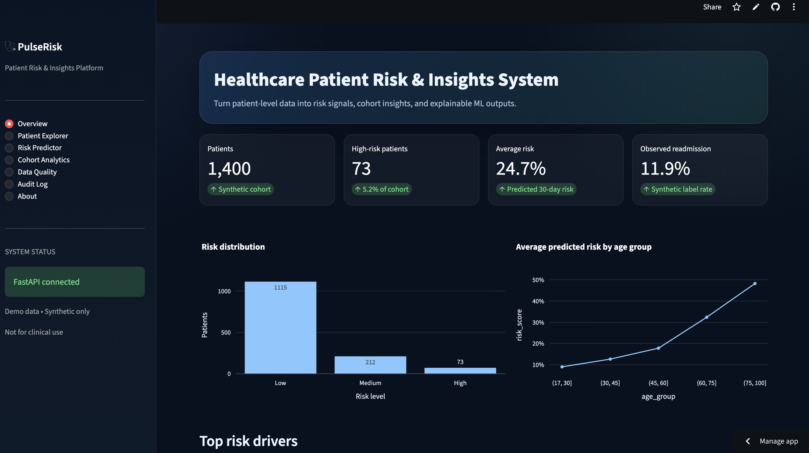
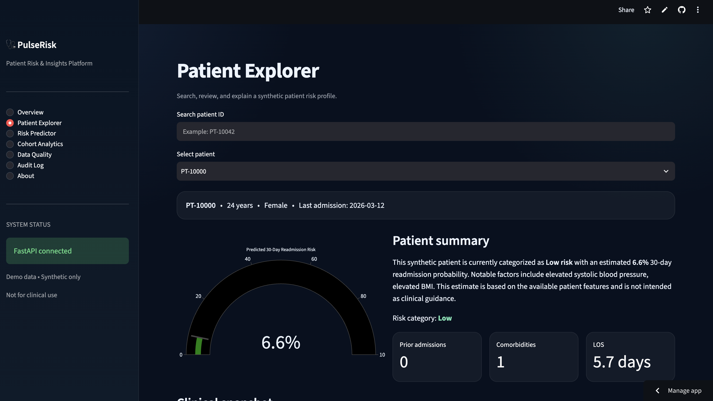
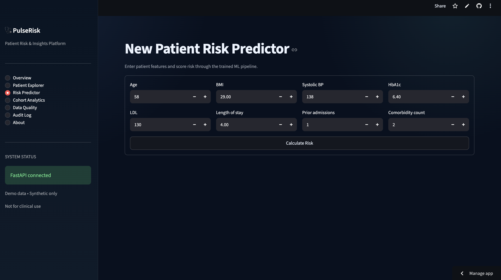
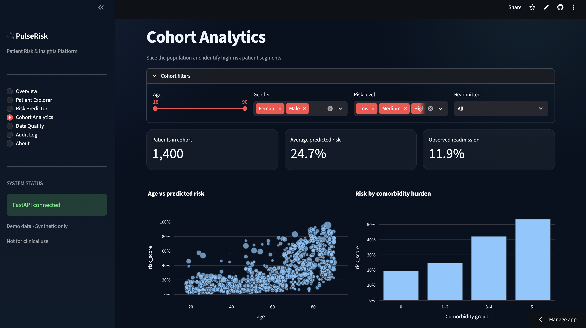
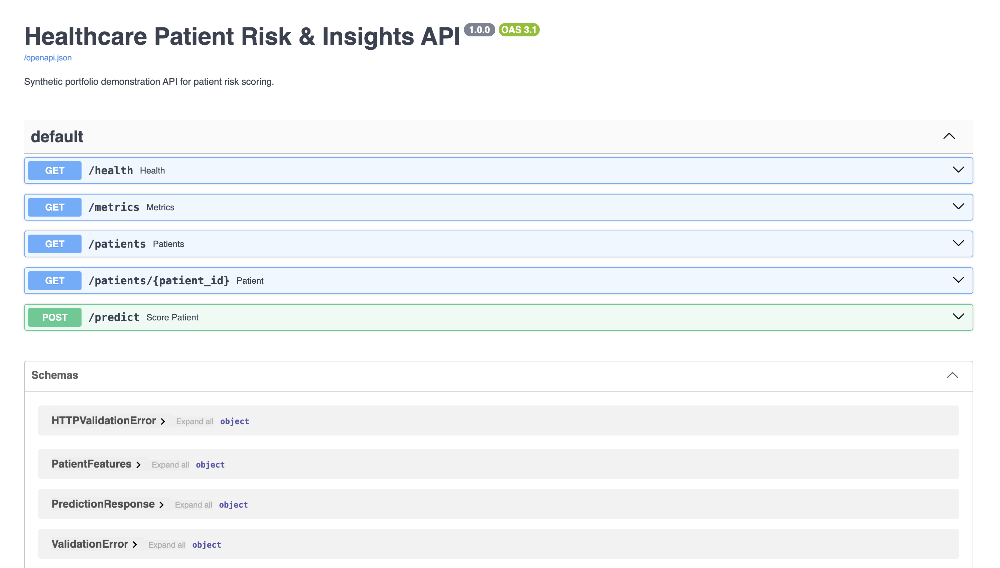

# PulseRisk

**Healthcare Patient Risk & Insights System**

PulseRisk is an end-to-end healthcare analytics application built with **Streamlit, FastAPI, and scikit-learn** for patient risk scoring, cohort analysis, and model-driven insights.

> **Important:** This project uses synthetic patient data and is intended for software and machine-learning demonstration only. It is not a medical device and must not be used for clinical decision-making.

## Live Demo

- **Live Application:** https://pulserisk-ai.streamlit.app/
- **API Documentation:** https://pulserisk-api.onrender.com/docs
- **Source Code:** https://github.com/HaripriyaReddyPatil/pulserisk

## Screenshots

### Overview


### Patient Explorer


### Risk Predictor


### Cohort Analytics


### API Documentation


## Overview

PulseRisk combines a web interface, REST API, machine-learning pipeline, and analytics layer in a single application.

Key capabilities include:

- Patient-level risk scoring
- REST API development with FastAPI
- Interactive Streamlit dashboards
- Explainable machine-learning outputs
- Cohort-level analytics
- Patient timeline and trend analysis
- Data-quality monitoring
- Audit logging
- Unit testing
- Docker-based deployment support

## Key Features

### Executive Dashboard

The overview dashboard provides a high-level view of the patient population, including:

- Total patient count
- High-risk patient count
- Average predicted risk
- Observed readmission rate
- Risk distribution
- Risk trends by age group
- Global model feature importance

### Patient Explorer

Users can search for or select a patient and review:

- Demographics
- Clinical profile
- Vitals and laboratory values
- Utilization history
- Predicted risk score
- Risk category
- Patient-specific risk drivers
- Clinical timeline
- Automated patient summary

### Risk Prediction

The application can estimate 30-day readmission risk for a new patient using:

- Age
- BMI
- Systolic blood pressure
- HbA1c
- LDL
- Length of stay
- Prior admissions
- Comorbidity count

Predictions are served through the FastAPI backend and displayed through the Streamlit frontend.

### Model Explainability

PulseRisk provides both global and patient-level explanations.

Global explanations show which variables contribute most to the model overall.

Patient-level explanations compare individual feature values with cohort-level reference values to estimate how each factor influences the predicted risk.

### Cohort Analytics

Users can filter and analyze patient groups based on:

- Age
- Gender
- Risk level
- Readmission status

The application also supports visualization of:

- Age versus predicted risk
- Risk by comorbidity burden
- Highest-risk patients in the selected cohort

### Data Quality

The Data Quality Center checks for:

- Missing values
- Duplicate patient records
- Out-of-range clinical values
- Dataset completeness

These checks help ensure that patient data is suitable for downstream analytics and model inference.

### Audit Log

The application records selected user actions for traceability, including:

- Patient profile views
- Risk predictions
- Cohort filter actions

Audit events are stored using SQLite.

## Architecture

```text
Synthetic Patient Data
        |
        v
Data Generation Pipeline
        |
        v
ML Training Pipeline
        |
        v
Random Forest Model
        |
        v
FastAPI Backend
  - /health
  - /patients
  - /patients/{id}
  - /predict
  - /metrics
        |
        v
Streamlit Frontend
  - Overview
  - Patient Explorer
  - Risk Predictor
  - Cohort Analytics
  - Data Quality
  - Audit Log
  - About
  
  ## Tech Stack

### Frontend

- Streamlit
- Plotly
- Pandas

### Backend

- FastAPI
- Pydantic
- Uvicorn

### Machine Learning

- scikit-learn
- RandomForestClassifier
- Preprocessing pipeline
- ROC-AUC evaluation
- Feature-importance analysis

### Data and Storage

- Synthetic healthcare dataset
- CSV
- SQLite

### Development and Deployment

- Git
- GitHub
- Docker
- Docker Compose
- Render
- Streamlit Community Cloud

## Project Structure

```text
pulserisk/
├── backend/
│   ├── __init__.py
│   ├── main.py
│   ├── schemas.py
│   └── services.py
│
├── frontend/
│   ├── __init__.py
│   └── app.py
│
├── ml/
│   ├── generate_data.py
│   ├── train_model.py
│   ├── risk_model.joblib
│   └── metrics.json
│
├── data/
│   └── patients.csv
│
├── tests/
│   └── test_api.py
│
├── Dockerfile.api
├── Dockerfile.streamlit
├── docker-compose.yml
├── requirements.txt
└── README.md
